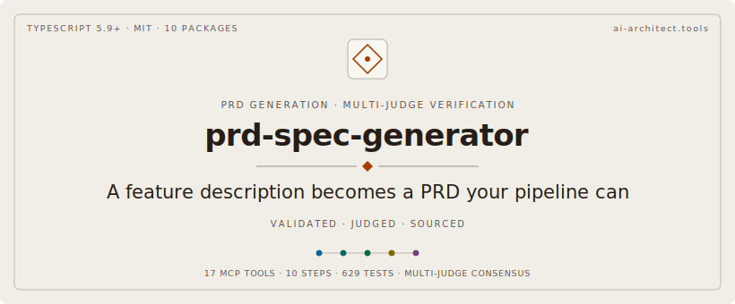

<p align="center">
  
</p>

<p align="center">
  
  
  
  
  
  
  
</p>

<p align="center">
  <a href="#what-an-agent-can-ask-it">What An Agent Asks</a> · <a href="#getting-started">Getting Started</a> · <a href="#the-pipeline">Pipeline</a> · <a href="#the-eleven-mcp-tools">Tools</a> · <a href="#multi-judge-verification">Verification</a> · <a href="#architecture">Architecture</a> · <a href="#the-zetetic-standard">Zetetic Standard</a>
</p>

<p align="center">
  <strong>Companion projects:</strong><br>
  <a href="https://github.com/cdeust/Cortex">Cortex</a> — persistent memory that injects past decisions into every PRD<br>
  <a href="https://github.com/cdeust/zetetic-team-subagents">zetetic-team-subagents</a> — 97 genius reasoning patterns that judge each claim<br>
  <a href="https://github.com/cdeust/automatised-pipeline">automatised-pipeline</a> — the codebase intelligence layer this generator consumes upstream
</p>

---

Every AI agent that drafts a PRD eventually invents a function that doesn't exist, claims latency it can't measure, or writes acceptance criteria that don't tie back to the requirements they're supposed to test. The output sounds confident. It is not actionable. The next stage in the pipeline — code generation, ticket import, sprint planning — silently inherits the hallucination, ships it, and pays for it later.

**prd-spec-generator** is a TypeScript MCP server that fixes this at the structural level. The pipeline is a stateless reducer (`step(state, result?) → next_state, action`) driven by a host (Claude Code or any MCP-speaking agent). Sections are produced one at a time, validated by deterministic Hard Output Rules before the host ever sees them, and every load-bearing claim is judged by a panel of genius reasoning agents drawn from `zetetic-team-subagents` against the codebase graph from `automatised-pipeline`.

**10 packages. 11 MCP tools. 9 pipeline steps. Multi-judge verification with consensus. 117 tests. Every numeric constant traces to a citation, a benchmark, or a `// source: provisional heuristic` admission.**

---

## What an agent can ask it

```
start_pipeline(feature_description, license_tier, codebase_path?)
  → returns the first NextAction; the host executes it and feeds the result
    back via submit_action_result. Nine steps later: 9 PRD files written.

submit_action_result(run_id, result)
  → drives the reducer one more step. The host sees only SUBSTANTIVE actions
    (ask_user, call_pipeline_tool, call_cortex_tool, spawn_subagents,
     write_file, done, failed). emit_message is coalesced into the
     messages array; the host never has to "advance past" a banner.

validate_prd_section(content, section_type)
  → deterministic Hard Output Rules — zero LLM calls, pure regex/parsing.
  → returns: violations[], hasCriticalViolations, totalScore.

validate_prd_document(sections[])
  → cross-section checks: SP arithmetic, AC numbering, FR-AC coverage,
    test traceability. Catches what per-section validation misses.

coordinate_context_budget(prd_context, completed_sections[])
  → per-section retrieval/generation token budgets so Cortex recall and
    section drafting don't fight over the same context window.

map_failure_to_retrieval(violations[])
  → closes the validation→retrieval feedback loop. When a section fails
    validation, this returns the corrective Cortex query that would
    have prevented the failure.
```

---

## Getting started

### Prerequisites

- Node.js **20.x or 22.x**
- pnpm **v10+** (`corepack enable && corepack prepare pnpm@10`)

### Clone + build

```bash
git clone https://github.com/cdeust/prd-spec-generator.git
cd prd-spec-generator
pnpm install --frozen-lockfile
pnpm build
pnpm test
# 117 tests pass + 2 integration skipped (live MCP integration is
# env-gated by AIPRD_PIPELINE_BIN)
```

### Register the MCP server

```bash
claude mcp add prd-gen -- node /absolute/path/to/packages/mcp-server/dist/index.js
```

Or wire via `.mcp.json` next to your project root:

```json
{
  "mcpServers": {
    "prd-gen": {
      "command": "node",
      "args": ["/absolute/path/to/packages/mcp-server/dist/index.js"]
    }
  }
}
```

Restart Claude Code. The 11 tools register on first stdio handshake.

### First run

```bash
# Smoke-test the reducer end-to-end without a real host:
pnpm test --filter @prd-gen/orchestration smoke

# Drive a benchmark KPI run with the canned dispatcher:
pnpm test --filter @prd-gen/benchmark pipeline-kpis
```

Both run in <2s on an M-series Mac. No LLM calls, no MCP traffic — the reducer is fully driven by canned ActionResults so you can audit behaviour offline.

---

## The pipeline

The reducer produces nine sequential steps. Each step emits at most one substantive action; the host executes it and feeds the result back. A typical trial-tier feature run (11 sections) takes ~62 host-visible iterations.

| # | Step | What it produces |
|---|------|------------------|
| **1** | `license_gate` | Banner + tier-aware capabilities (free / trial / licensed) |
| **2** | `context_detection` | Detects PRD type from trigger words; asks user when ambiguous |
| **3** | `input_analysis` | Calls `index_codebase` (automatised-pipeline) when a path is provided; sets `codebase_graph_path` |
| **4** | `feasibility_gate` | Detects epic-scope inputs (≥2 EPIC_SIGNALS); asks user to focus |
| **5** | `clarification` | Compose-then-answer rounds (4–10 depending on tier); short-circuits on "proceed" |
| **6** | `budget` | Per-section retrieval/generation token allocation via Cortex paper's 60/30/10 split |
| **7** | `section_generation` | One section at a time: Cortex recall → engineer draft → validate → (retry up to 3) |
| **8** | `jira_generation` | Synthesises JIRA tickets from requirements + user_stories + acceptance_criteria |
| **9** | `file_export` | Writes 9 files (6 core + 3 companion) per SKILL.md Phase 4 |
| **10** | `self_check` | Two-phase multi-judge verification (see below); typed `verification` field on `done` |

Every step is independently testable (`stepOnce(state, result?)` returns the same shape as the runner). The runner coalesces `emit_message` actions internally so the host never sees a no-op.

---

## The eleven MCP tools

Two surfaces. The first is the reducer — three tools that drive the full pipeline. The second is direct validation + budget tooling that other systems can consume without entering the pipeline.

```
Reducer:
  start_pipeline          Initialize a run; returns first NextAction
  submit_action_result    Drive the reducer one step; returns next NextAction
  get_pipeline_state      Read-only state snapshot for diagnostics

Validation:
  validate_prd_section       Hard Output Rules — single section
  validate_prd_document      Cross-section checks (SP/AC/FR/test traceability)

Verification:
  plan_section_verification  Extract claims + select judge panels
  conclude_section           Aggregate verdicts → ConsensusVerdict[]
  plan_document_verification Same, document-wide
  conclude_document          Aggregate verdicts → VerificationReport

Budget + feedback:
  coordinate_context_budget  Per-section token allocation
  map_failure_to_retrieval   Validation failure → corrective Cortex query
```

Each tool takes structured Zod-validated arguments and returns a typed response. No tool calls an LLM — section drafts and judge verdicts come back via the host's `spawn_subagents` action so the same pipeline runs against any agent runtime.

---

## Multi-judge verification

The `self_check` step is a two-phase contract. Phase A plans the verification batch and persists a snapshot of `(claim_ids, judges)` to state. Phase B receives the verdicts, parses them against the snapshot, and aggregates via the consensus engine.

```
plan_document_verification(sections[])
  → extracts atomic Claims (FR-001, AC-005, NFR-LATENCY-1, ...)
  → selects a panel per claim type:
      architecture        → liskov + alexander + dijkstra + architect
      performance         → fermi + carnot + curie + erlang
      security            → wu + ibnalhaytham + security-auditor
      data_model          → mendeleev + dba + lavoisier
      acceptance_criteria → toulmin + popper + test-engineer
      ...

[host spawns the panel; each agent returns a JSON verdict]

conclude_document(verdicts[])
  → Per claim, runs consensus():
      strategy: weighted_average (default) | bayesian
      fail_threshold: 0.5  (≥50% confidence-weighted FAIL → forces FAIL)
      precautionary tie-breaker: more-severe verdict wins
  → distribution_suspicious flag fires when 100% PASS over ≥5 claims
  → returns ConsensusVerdict[] with full distribution + dissenting list
```

The verdict taxonomy is deliberately five-level — not binary. NFR claims (latency, fps, throughput, storage) **MUST NOT receive PASS**: they are SPEC-COMPLETE if a measurement method is specified, NEEDS-RUNTIME otherwise. Judges that default to PASS for everything are caught by the `distribution_suspicious` detector and flagged in the typed `done.verification` field.

---

## Architecture

Ten workspace packages, each independently buildable, with strict Clean Architecture layering enforced by package boundaries.

```
core              ← domain types, schemas, agent identities
                    │  no I/O, no infrastructure dependency
                    │  Zod-validated; the only place where verdict /
                    │  section_type / license_tier shapes are defined
                    ▼
validation        ← Hard Output Rules (per-section + cross-section)
                    │  pure functions; no I/O
                    ▼
strategy          ← thinking-strategy selector (genius pattern routing)
                    │
meta-prompting    ← prompt builders for clarification / draft / jira
                    │  pure string composition
                    ▼
verification      ← claim extraction + judge selection +
                    │  consensus engine (weighted_average + Bayesian)
                    │  + buildJudgePrompt
                    ▼
orchestration     ← stateless reducer, 9 step handlers, runner
                    │  step(state, result?) → next_state, action
                    │  emit_message coalescing; canned-dispatcher utility
                    ▼
ecosystem-adapters← StdioMcpClient, AutomatisedPipelineClient, CortexClient
                    │  the only package allowed to do I/O
                    ▼
mcp-server        ← composition root; 11 tools registered;
                    │  evidence repository (better-sqlite3, optional)
                    ▼
benchmark         ← pipeline KPI measurements + golden-fixture HOR scoring
skill             ← SKILL.md + slash-command definitions for Claude Code
```

### Dependency rule (absolute)

Every package's `package.json` is checked: `core` depends only on `zod`; `verification` depends only on `core`; `orchestration` depends on `core`/`validation`/`verification`/`meta-prompting` (NOT on `ecosystem-adapters`); `ecosystem-adapters` depends on `core` + `verification`; `mcp-server` is the only place where everything composes.

The Phase 3+4 cross-audit found and fixed two layer violations:
- `orchestration` was importing `extractJsonObject` and `buildJudgePrompt` from `ecosystem-adapters` — pure utilities lived in the wrong package; moved to `core` and `verification` respectively.
- Pure domain types (`Claim`, `JudgeVerdict`, `JudgeRequest`, `AgentIdentity`) lived in `ecosystem-adapters/contracts/subagent.ts`; moved to `core/domain/agent.ts`. The infrastructure package now re-exports them as a backward-compat shim.

---

## What this fixes that previous PRD generators don't

| Failure mode | What we do |
|---|---|
| **Section drift between turns** | Single immutable `PipelineState` snapshot per step; reducer is pure; host can replay any step |
| **Hallucinated symbols** | `validate_prd_section` runs Hard Output Rules; symbols cross-checked against `automatised-pipeline` graph if `codebase_path` is set |
| **NFRs claiming PASS without measurement** | Verdict taxonomy refuses PASS for latency/throughput/fps/storage; consensus engine forwards SPEC-COMPLETE / NEEDS-RUNTIME |
| **Confirmatory bias (every judge says PASS)** | `distribution_suspicious` flag fires at 100% PASS over ≥5 claims; surfaced in typed `done.verification.distribution_suspicious` |
| **Acceptance criteria not traceable to requirements** | Cross-document validator checks FR-AC coverage and AC numbering gaps |
| **Tests claiming "comprehensive" without listing what they cover** | Test-traceability rule: every section's claimed test must reference an FR or AC ID |
| **Retries that use the same context as the failure** | `map_failure_to_retrieval` closes the validator→Cortex feedback loop; corrective queries before retry |
| **Magic-number budgets ("we'll use 4K tokens for retrieval")** | `coordinate_context_budget` produces per-section allocations from the canonical SECTIONS_BY_CONTEXT plan |

---

## How it composes with the rest of the ecosystem

```
                            ┌────────────────────────────────────┐
                            │         Claude Code (host)         │
                            └────────────────────┬───────────────┘
                                                 │ stdio MCP
              ┌──────────────────────────────────┼──────────────────────────────────┐
              ▼                                  ▼                                  ▼
   ┌───────────────────┐              ┌────────────────────┐              ┌───────────────────┐
   │   automatised-    │   graph_path │   prd-spec-        │  recall      │      Cortex       │
   │   pipeline        │ ───────────► │   generator        │ ◄─────────── │   (memory engine) │
   │   (Rust MCP)      │              │   (TS MCP)         │              │   (Python MCP)    │
   │                   │   symbols    │                    │  excerpts    │                   │
   │   read-only       │ ◄──────────► │   stateless        │ ───────────► │   thermodynamic   │
   │   intelligence    │              │   reducer          │              │   memory          │
   └───────────────────┘              └─────────┬──────────┘              └───────────────────┘
                                                │
                                                │ spawn_subagents
                                                ▼
                                  ┌─────────────────────────────┐
                                  │   zetetic-team-subagents    │
                                  │   97 genius + 19 team       │
                                  │   Each judge cites its      │
                                  │   primary paper.            │
                                  └─────────────────────────────┘
```

Each project owns one concern. `automatised-pipeline` knows what's true about the code. Cortex knows what we already decided. zetetic-team-subagents knows how to reason about a specific shape of claim. **prd-spec-generator** is the deterministic glue that turns those three signals into a PRD an agent can act on.

---

## The Zetetic Standard

Every load-bearing constant in this codebase carries a `// source:` annotation. Three forms are accepted:

```typescript
// source: <citation>          // a paper, a spec, a referenced design doc
// source: benchmark <path>    // a committed benchmark whose output produced this value
// source: provisional heuristic — <calibration plan>
                               // honest admission; tells the next reader
                               // (a) why the value is what it is today and
                               // (b) what evidence would change it
```

The cross-audit found and tagged every previously bare constant. Examples:

```typescript
// pipeline-kpis.ts
const KPI_GATES = {
  /** source: provisional heuristic. Smoke baseline = 62 iterations on
   *  trial+codebase; cap is 100 (~60% headroom). dijkstra cross-audit
   *  derived a structural max of 9 emit_message hops; the substantive-
   *  action count builds on that. Phase 4.5 will replace with measured
   *  P95 + 1σ. */
  iteration_count_max: 100,
  ...
};

// verification/consensus.ts
/** source: provisional heuristic — Beta(7,3) (mean 0.7, ESS=10,
 *  moderately informative toward reliability). Phase 4.1 will replace
 *  with per-agent Beta(α+correct, β+incorrect) calibrated from history. */
const DEFAULT_RELIABILITY_PRIOR_MEAN = 0.7;
```

The four pillars (consistent / true / useful / necessary) and the seven rules of zetetic inquiry are inherited from the [zetetic-team-subagents standard](https://github.com/cdeust/zetetic-team-subagents#the-zetetic-standard). Provisional values are not silently propagated as truth.

---

## What this system does not do

The same standard applied to itself.

1. **It does not write code.** This generator produces a PRD. The downstream coding agent (separate system) reads the PRD, the graph, and Cortex memory; it writes the implementation. Symbols in the PRD are validated against the graph but never edited by us.
2. **It does not validate prose quality.** Hard Output Rules check structural invariants (FR numbering, AC traceability, NFR shape, cross-references). They do not check whether a sentence is well-written or persuasive. That is what the multi-judge phase is for, and even there the judges return verdicts on *claims* — atomic assertions — not on style.
3. **The judge phase is end-to-end testable but the judges are not deterministic.** In tests we use a canned dispatcher that returns 100% PASS by construction; the `distribution_suspicious` detector exists precisely because real judge panels can also degenerate into confirmatory consensus, and we do not pretend otherwise.
4. **The KPI gates are provisional.** `iteration_count_max=100`, `wall_time_ms_max=500`, `mean_section_attempts_max=2.5` — every threshold currently traces to a canned-dispatcher baseline, not a production-shaped run. Phase 4.5 calibrates them against K≥100 real PRDs (see [PHASE_4_PLAN.md](PHASE_4_PLAN.md)).
5. **Citation presence ≠ citation validity.** A `// source: Knuth 1998` comment satisfies the convention whether or not Knuth 1998 exists or supports the value. We enforce that the citation IS THERE; the cross-audit cycle (genius + team review every phase) is what keeps it honest.

---

## Reproducing the audit cycle

The repo ships a multi-agent cross-audit workflow. After every non-trivial phase:

```bash
# Engineering team review:
#   architect, code-reviewer, refactorer, test-engineer, security-auditor,
#   devops-engineer, dba (when relevant)

# Genius team review:
#   feynman (integrity), curie (measurement), popper (falsifiability),
#   dijkstra (correctness), shannon (signal), deming (variation),
#   poincare (qualitative), ...
```

Each agent reads the current state of the code (not from memory) and produces a ranked finding list. The Phase 3+4 cycle generated 30 findings; 28 were closed in the same cycle (4 CRIT + 13 HIGH + 11 MED). Two are deferred to Phase 4 calibration with the evidence required to close them documented in PHASE_4_PLAN.md.

---

## Project layout

```
packages/
├── core/                  Domain types · schemas · agent identities · evidence repo
├── validation/            Hard Output Rules · per-section + cross-section validators
├── verification/          Claim extraction · judge selection · consensus engine
├── meta-prompting/        Prompt builders (clarification / draft / jira)
├── strategy/              Thinking-strategy selector
├── orchestration/         Stateless reducer · 9 step handlers · runner · canned-dispatcher
├── ecosystem-adapters/    StdioMcpClient · AutomatisedPipelineClient · CortexClient
├── mcp-server/            Composition root · 11 MCP tools registered
├── benchmark/             Pipeline KPI measurement · golden-fixture HOR scoring
└── skill/                 SKILL.md · slash-command definitions
```

---

## License

MIT.

---

<p align="center">
  <em>Don't ship a PRD that hallucinates a function it can't measure.<br>
  Ship one whose every claim was judged by Pearl, Curie, Liskov, and a panel of seven others, validated against the call graph, and grounded in what Cortex remembers from yesterday.</em>
</p>
